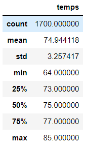
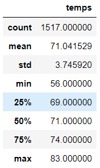

# surfs_up

## Overview of Analysis
W. Avy requests for more information regarding temperature trends in Oahu for his business. He specifically asks for the months of June and December to determine if the surf and ice cream shop is sustainable year-round.

## Analysis

### Analysis of Temperatures in June

- In the month of June, we discover a total count of 1700 temperature data, a mean temperature of 74.9 degrees, a mininum temperature of 64.0,  a maximum temperature of 85.0, and a standard deviation of 3.2.

### Analysis ofTemperatures in December

- In the month of December, we discover a total count of 1517 temperature data, a mean temperature of 71.0 degrees, a mininum temperature of 56.0, a maximum temperature of 83.0, and a standard deviation of 3.7.

- Judging from the minimum temperature difference between the two months, we can expect less customers in the month of Decemeber as the minimum temperature is approximately 8 degrees lower, which makes sense since it's winter. 

## Summary
The mean temprature is about the same and the standard deviation is not so different. Considering the mean temperature and the standard deviation, we can assume the shop will be sustainable year-round. We can run another query that compares the precipitation data of June and December. Lastly, we can determine if there are any outliers to exclude in order to provide us a more focused analysis based on the weather station with the most amount of data.
